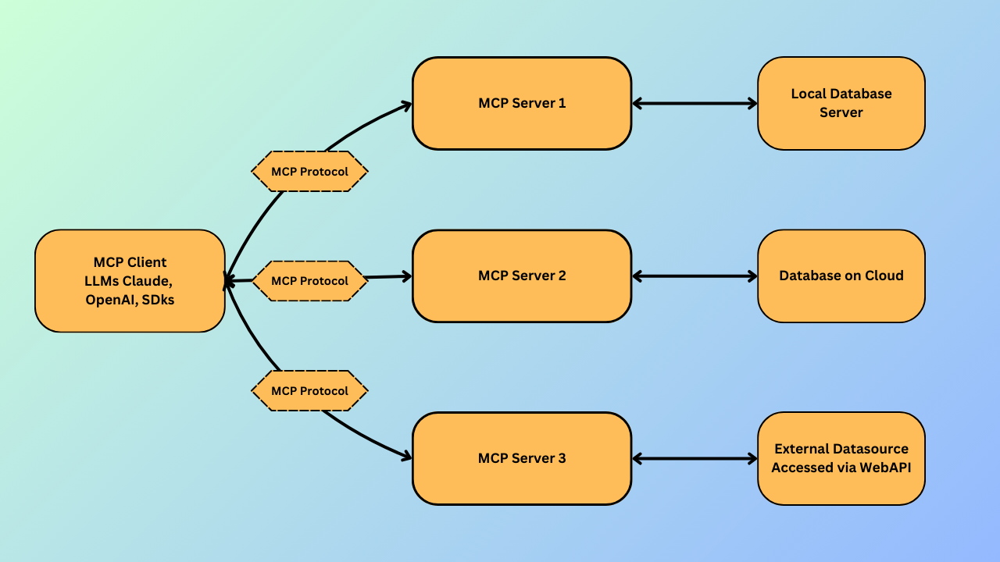

# SQL Server Agent - Modal Context Protocol
Here is the SQL Server Agent that let's you Interact with the SQL Server Database in the Natural Language leveraging the Modal Context Protocol as a layer between our LLMs and Data Source.

## Key Features:

* **Talk to Your Database**: Chat with SQL Server using plain English.
* **No-Code Database Operations**: Manage your database tasks entirely through natural conversations.
* **One-Click Procedure Execution**: Run stored procedures effortlessly with natural commands.
* **MCP-Enhanced Accuracy**: Achieve precise database interactions through Modal Context Protocol (MCP), intelligently connecting your commands to data.
* **Context-Aware Conversations**: Enjoy seamless interactions powered by Modal Context Protocol.

## What is MCP?
MCP (Modal Context Protocol) is a metodology that stats how we should bind the context to the LLMs.
MCP provides a standardized way to connect AI models to different data sources and tools.

## Why MCP?
MCP helps us to build the complex workflows in a simplified way to build the Agents on top of LLMs where the laguage models needs a frequent integration with the data sources and tools.

## MCP Architecture:
The MCP architecture follows a client-server model, allowing a single client to interact seamlessly with multiple servers.




**MCP-Client**: Your AI client (LLM) accessing data.

**MCP-Protocol**: Connects your client directly to the server.

**MCP-Server**: Helps your client access data sources via MCP.

**Local Database, Cloud Database, External APIs**: Sources providing data through local storage, cloud, or online APIs.

## Now, Let's Dive Into the Implementation
With an understanding of MCP and its architecture, it's time to bring it all together with the **SQL Server Agent**.

### What is SQL Server Agent?
The **SQL Server Agent** is a conversational AI Query CLI that enables you to **interact with your SQL Server Database using natural language**. Powered by the **Modal Context Protocol**, it acts as a smart layer between your language model and the database, making it possible to:

- Query your database without writing SQL
- Execute stored procedures with conversational commands
- Perform complex operations while maintaining context across multiple steps

Whether you're a developer, analyst, or non-technical user, this agent makes your data accessible through intuitive, human-like interactions.

Now, let’s walk through how to get it up and running 👇

## Prerequisites
Before you get started, make sure you have the following:

- **Python 3.12+** installed on your machine  
- A valid **OpenAI API Key**

## Getting Started
Follow these steps to get the project up and running:
### 1. Clone the Repository

```bash
git clone https://github.com/Amanp17/mcp-sql-server-natural-lang.git
cd mcp-sql-server-natural-lang
```

### 2. Install Dependencies
```bash
pip install -r requirements.txt
```
### 3. Setup Environment Variables

Create a `.env` file in the root of the project and add the following:

```dotenv
OPENAI_API_KEY=your_openai_api_key
MSSQL_SERVER=localhost
MSSQL_DATABASE=your_database_name
MSSQL_USERNAME=your_username
MSSQL_PASSWORD=your_password
MSSQL_DRIVER={ODBC Driver 17 for SQL Server}
```

## Running the SQL Server Agent
Once you've set up your environment and dependencies, you're ready to interact with the SQL Server Agent.

### Run the Client Script
Execute the following command to start the agent:

```bash
python mcp-ssms-client.py
```

Once the script starts, it will prompt you like this:

```bash
Enter your Query:
```

Now, you can type your request in plain English. For example:

```swift
Create a Employee table with 10 dummy data in it with their departments and salaries.
```

The agent will process your input using the Modal Context Protocol and return the relevant data from your SQL Server database.

🧠 Tip: You can ask follow-up questions or make requests like "show me the employees and their departments?" or "how many employees are having salary under $40K?" — the context is preserved!

## Conclusion

The **SQL Server Agent** powered by the **Modal Context Protocol (MCP)** brings the power of conversational AI to your database operations. By bridging the gap between natural language and SQL, it allows users to interact with their data effortlessly, making database access more intuitive, efficient, and accessible to everyone even those without technical expertise.

Whether you're querying data, executing procedures, or building complex workflows, this agent serves as your intelligent interface to SQL Server.

Feel free to contribute, open issues, or suggest enhancements — we're building the future of AI-driven data interaction together! 🚀
